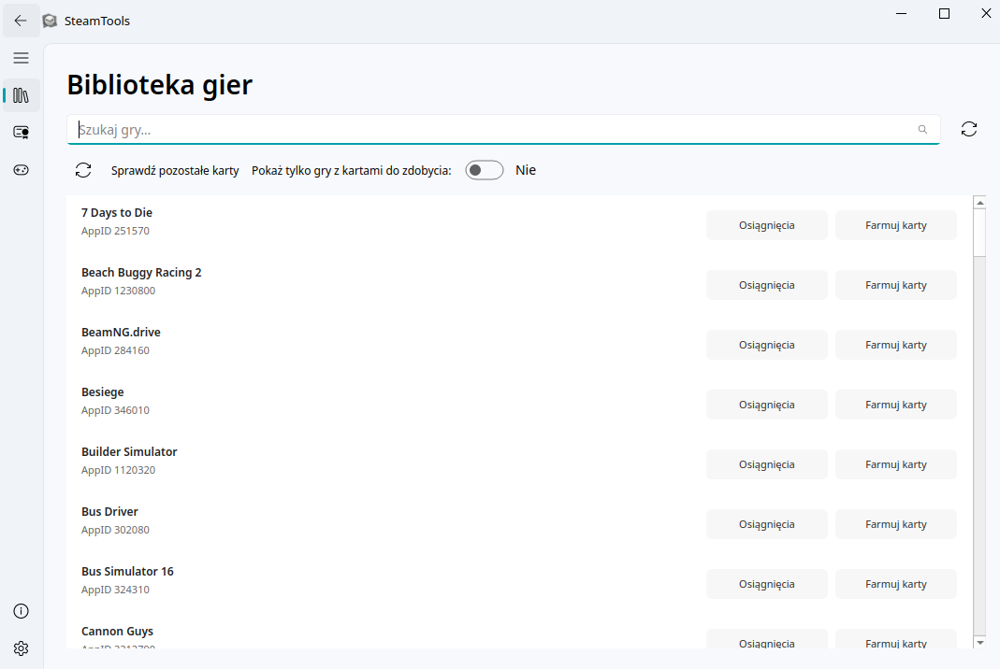
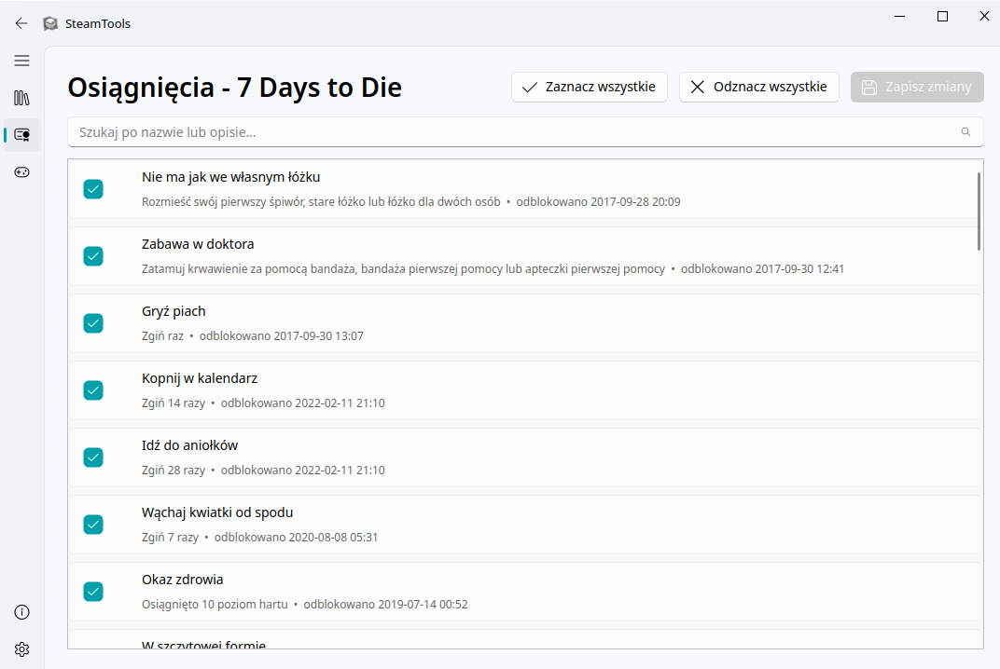
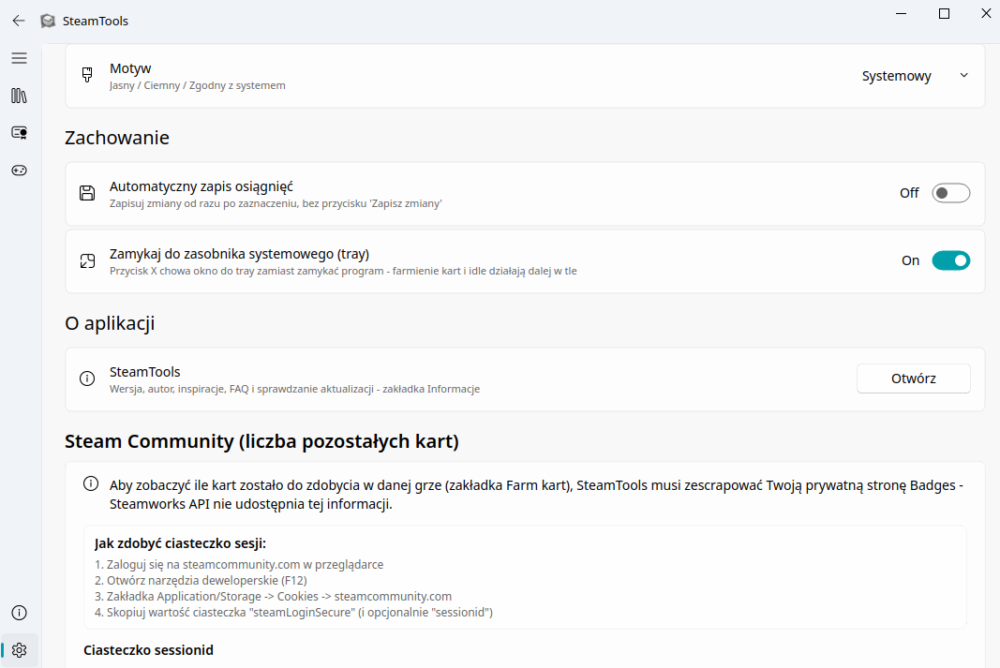

# SteamTools

Natywna aplikacja linuksowa łącząca dwie funkcje znane z Windows-owych
narzędzi **SAM (Steam Achievement Manager)** oraz **idle_master_extended**:

- **Osiągnięcia** - podgląd, ręczne odblokowywanie/blokowanie osiągnięć gier na Twoim koncie.
- **Farm kart** - card idling: zgłaszanie procesu do klienta Steam jako "grający", żeby naliczały się karty kolekcjonerskie z wielu gier naraz.

Zbudowana na PyQt6 + PyQt6-Fluent-Widgets (sidebar, nowoczesny Fluent Design zamiast klasycznego WinForms).

## Zrzuty ekranu

| Biblioteka gier | Osiągnięcia |
|:---:|:---:|
|  |  |

| Ustawienia |
|:---:|
|  |


## Dlaczego to działa natywnie na Linuksie (w przeciwieństwie do oryginałów)

Oba oryginalne narzędzia (`idle_master_extended`, `SteamAchievementManager`)
są napisane w .NET Framework 4.8 + WinForms, z bezpośrednimi wywołaniami
Win32 API (`kernel32.dll`, `user32.dll`) i `Microsoft.mshtml` (IE WebBrowser
control) - żadne z tego nie istnieje na Linuksie.

SteamTools omija ten problem, bo cała komunikacja ze Steamem idzie przez
**Steamworks SDK "flat" C API**, które Valve dystrybuuje również jako
natywną bibliotekę Linux (`libsteam_api.so`). Zamiast .NET P/Invoke na
WinAPI, używamy zwykłego `ctypes` w Pythonie - patrz `steamtools/core/steamworks.py`.

## Wymagany krok ręczny: Steamworks SDK

Ze względu na licencję Valve, plik `libsteam_api.so` **nie jest dołączony**
do tego repo. Trzeba go samodzielnie umieścić:

1. Pobierz Steamworks SDK z partnerskiego panelu Valve (https://partner.steamgames.com/).
2. Skopiuj `sdk/redistributable_bin/linux64/libsteam_api.so` do:
   ```
   steamtools/vendor/linux64/libsteam_api.so
   ```

Bez tego pliku aplikacja uruchomi się (UI działa), ale funkcje Steamworks
(osiągnięcia, farm kart) zgłoszą błąd `SteamworksError` z jasnym komunikatem.

## Instalacja (dev)

Najprościej przez gotowe skrypty (patrz sekcja niżej), ale ręcznie też można:

```bash
python3 -m venv .venv
source .venv/bin/activate
pip install -r requirements.txt
python -m steamtools.app
```

**WAŻNE**: nazwa katalogu środowiska to `.venv` (z kropką), nie `venv` - tak
tworzy go `venv.sh`, tak odwołuje się do niego `run.sh`, i tak jest wpisane
w `.gitignore`. Użycie innej nazwy nie jest błędem samo w sobie, ale trzeba
wtedy pamiętać o aktywacji WŁAŚCIWEGO środowiska przed każdą komendą
(`pip install`, `python -m steamtools.app`, `pyinstaller`) - w przeciwnym
razie polecenia po cichu użyją systemowego/globalnego Pythona, w którym
zależności projektu (PyQt6-Fluent-Widgets itd.) nie są zainstalowane.

## Skrypty pomocnicze

```bash
./venv.sh   # tworzy .venv/, instaluje requirements.txt, sprawdza libsteam_api.so
./run.sh    # sprawdza .venv, w razie potrzeby proponuje uruchomić venv.sh, odpala aplikację
```

## Budowanie

**Najprościej: `build.sh`** - spina cały łańcuch (PyInstaller -> .deb ->
AppImage) w jedno polecenie, sprząta po sobie i zostawia w `dist/`
WYŁĄCZNIE gotowe pliki do rozdania:

```bash
./build.sh 0.1.0        # argument to wersja, domyślnie 0.1.0
# wynik: dist/steamtools_0.1.0_amd64.deb
#        dist/SteamTools-x86_64.AppImage
```

`build.sh` **sam aktywuje `.venv`** (nie trzeba `source .venv/bin/activate`
ręcznie) - jeśli `.venv` jest już aktywne w bieżącej sesji terminala, nie
robi tego ponownie; jeśli `.venv` w ogóle nie istnieje, odsyła do `venv.sh`.
Usuwa `dist/` i `build/` na samym początku (żeby nie mieszać plików z
poprzedniego builda z nowym), i usuwa `build/` oraz pośrednie
`dist/steamtools/` (rozpakowaną binarkę PyInstaller) na końcu - w `dist/`
zostają tylko finalne `.deb` i `.AppImage`.

### Budowanie krok po kroku (dla debugowania)

Jeśli `build.sh` się nie powiedzie i trzeba dojść do przyczyny, poniższe
kroki robią to samo, ale osobno - `dist/steamtools/` (wynik PyInstaller)
zostaje na dysku między krokami, więc można go samodzielnie sprawdzić.
`packaging/build_deb.sh` i `packaging/build_appimage.sh` NIE są zbędne
mimo istnienia `build.sh` - `build.sh` woła je wewnątrz siebie, to warstwa
orkiestrująca (aktywacja `.venv`, kolejność, sprzątanie), a te dwa skrypty
to warstwa robocza, którą też można wywołać osobno.

**W tej ścieżce (krok po kroku, bez `build.sh`) trzeba samodzielnie
aktywować `.venv`** przed każdą komendą - `build.sh` robi to automatycznie,
ale `pyinstaller`/`packaging/*.sh` wywołane bezpośrednio już nie:

```bash
source .venv/bin/activate   # KAŻDORAZOWO przed budowaniem, w tej samej sesji terminala
```

#### Binarka PyInstaller

```bash
source .venv/bin/activate
pyinstaller packaging/steamtools.spec --noconfirm
# wynik: dist/steamtools/steamtools (katalog --onedir, nie pojedynczy plik)
```

#### Pakiet .deb

```bash
source .venv/bin/activate
./packaging/build_deb.sh 0.1.0
# wynik: build/deb/steamtools_0.1.0_amd64.deb
sudo dpkg -i build/deb/steamtools_0.1.0_amd64.deb
```

Jeśli `dpkg -i` poskarży się na brakującą zależność (np. `libxcb-cursor0`),
to nie błąd pakietu - dokończ instalację przez:
```bash
sudo apt-get install -f
```

#### AppImage

```bash
source .venv/bin/activate
./packaging/build_appimage.sh
# wynik: build/appimage/SteamTools-x86_64.AppImage
chmod +x build/appimage/SteamTools-x86_64.AppImage
./build/appimage/SteamTools-x86_64.AppImage
```

## Struktura projektu

```
build.sh                          # buduje .deb + AppImage w jednym kroku, wynik w dist/
venv.sh / run.sh                  # patrz sekcja "Skrypty pomocnicze"
docs/
└── screenshots/                  # zrzuty ekranu użyte w tym README
steamtools/
├── app.py                        # punkt wejścia
├── core/
│   ├── steamworks.py             # ctypes wrapper na Steamworks flat API
│   ├── idler.py                  # menedżer procesów card-idling (limit, kolejka, persystencja)
│   ├── library.py                # skan lokalnej biblioteki gier (.acf) + parser VDF
│   ├── badges.py                 # scraping Steam Community (liczba pozostałych kart)
│   └── config.py                 # persystencja: kolejka idle, sesja Steam Community
├── ui/
│   ├── main_window.py            # FluentWindow + sidebar
│   └── views/
│       ├── library_view.py       # lista gier (QListView + custom delegate)
│       ├── achievements_view.py  # widok osiągnięć
│       ├── idle_view.py          # kolejka farmienia kart
│       ├── settings_view.py      # ustawienia / motyw / sesja Steam Community
│       └── about_view.py         # informacje o aplikacji / FAQ
├── resources/
│   └── icons/                    # pełny zestaw ikon (16-512px) + steamtools.png
└── vendor/
    └── linux64/libsteam_api.so   # dołączone w repo (patrz sekcja wyżej)
packaging/
├── steamtools.spec               # spec PyInstaller (--onedir, patrz build.sh)
├── build_deb.sh
└── build_appimage.sh
```

## Znane ograniczenia / TODO

Pełna, aktualna lista zadań i ich status prowadzona jest w `ROADMAP.md`.
Najważniejsze otwarte punkty:

- Okładki gier w Bibliotece - obecnie ikona placeholder (`FluentIcon.GAME`),
  docelowo cache lokalny (`appcache/librarycache/`) lub Steam Web API.
- Brak rozróżnienia gier posiadanych-ale-niezainstalowanych - biblioteka
  bazuje wyłącznie na lokalnie zainstalowanych grach (`appmanifest_*.acf`);
  pełne pokrycie konta wymagałoby Steam Web API z osobnym kluczem.
- Wykrywanie liczby pozostałych kart (`core/badges.py`) wymaga ręcznego
  skopiowania ciasteczka sesji z przeglądarki (Ustawienia) - to celowe,
  bezpieczne podejście (żaden hasło/login nie przechodzi przez aplikację),
  ale jest krokiem ręcznym, który trzeba powtórzyć gdy sesja wygaśnie.
